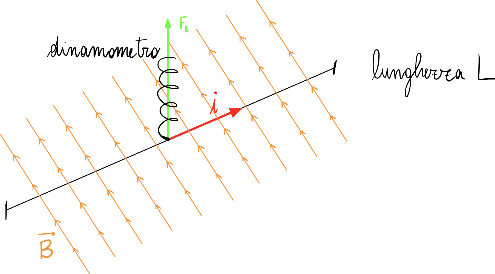
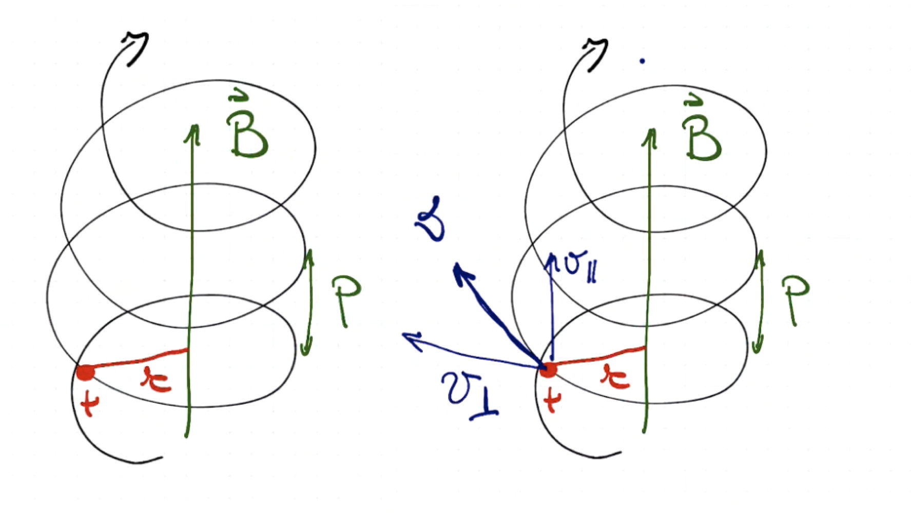
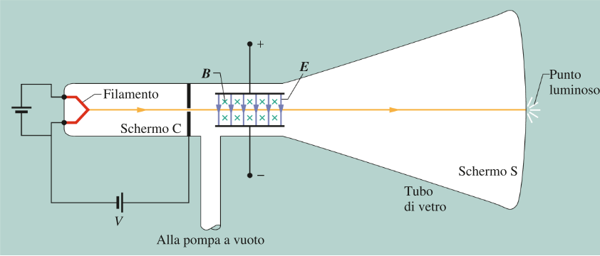

---
export_on_save:
  html: true
---

@import "./Copertina/Frontespizio.pdf"

# Indice {ignore=true}

<!-- @import "[TOC]" {cmd="toc" depthFrom=2 depthTo=6 orderedList=false} -->
<!-- code_chunk_output -->

- [Campo elettrico in analogia al campo elettrico](#campo-elettrico-in-analogia-al-campo-elettrico)
- [Campo magnetico su un filo](#campo-magnetico-su-un-filo)
- [Moto di una particella nel campo magnetico](#moto-di-una-particella-nel-campo-magnetico)
  - [Moto circolare uniforme](#moto-circolare-uniforme)
  - [Moto qualunque](#moto-qualunque)
- [Campi incrociati: esperimento di Thomson](#campi-incrociati-esperimento-di-thomson)
  - [Fase 2](#fase-2)
  - [Fase 3](#fase-3)
- [Effetto Hall](#effetto-hall)
- [Esperimento di Millikan](#esperimento-di-millikan)
- [Campi magnetici generati da correnti](#campi-magnetici-generati-da-correnti)
  - [Campo di un filo rettilineo](#campo-di-un-filo-rettilineo)
  - [Campo magnetico nel centro di una spira conduttrice circolare](#campo-magnetico-nel-centro-di-una-spira-conduttrice-circolare)
  - [Campo del solenoide](#campo-del-solenoide)
  - [Interazione corrente corrente](#interazione-corrente-corrente)
  - [Azione di un campo magnetico su una spira percorsa da corrente](#azione-di-un-campo-magnetico-su-una-spira-percorsa-da-corrente)
    - [Motore elettrico in corrente continua](#motore-elettrico-in-corrente-continua)
- [Il flusso](#il-flusso)
- [La circuitazione](#la-circuitazione)
- [Le proprietà magnetiche della materia](#le-proprietà-magnetiche-della-materia)
  - [Permeabilità magnetica relativa](#permeabilità-magnetica-relativa)
  - [Momenti microscopici](#momenti-microscopici)
  - [Polarizzazione dei materiali diamagnetici](#polarizzazione-dei-materiali-diamagnetici)
    - [Caso A](#caso-a)
    - [Caso B](#caso-b)
  - [Polarizzazione dei materiali paramagnetici](#polarizzazione-dei-materiali-paramagnetici)
  - [I materiali ferromagnetici](#i-materiali-ferromagnetici)
  - [Ferromagnetismo e ciclo di isteresi](#ferromagnetismo-e-ciclo-di-isteresi)
  - [Applicazioni](#applicazioni)

<!-- /code_chunk_output -->

&nbsp;

# Campo magnetico

In una regione di spazio è presente un campo magnetico se un ago magnetico posto in questa regione è soggetto ad una azione meccanica

Un campo magnetico è generato, per esempio, da una calamita, che ha un polo nord e un polo sud.

Le linee di forza sono chiuse, e lo posso capire mettendo della limatura di ferro in prossimità della calamita.

Le calamite naturali sono fatte di **magnetite**.

Non esiste il monopolo magnetico; infatti, posso dividere infinitamente una calamita, ma questa avrà sempre un polo nord e un polo sud. Questo porta ad avere delle linee di forza chiuse, dal polo nord al polo sud.

La sonda per il campo magnetico è un ago di natura magnetica, e se l’ago ruota sarà soggetto a campo magnetico: ciò è dovuto ad una coppia di forze che fa ruotare l’ago magnetico.

I poli opposti si attraggono.

&nbsp;

## Campo elettrico in analogia al campo elettrico

Io posso vedere se in una certa zona di spazio è presente un campo elettrico per mezzo di una sonda di natura elettrica, come ad esempio un elettrone.

@import "/assets/gg.png" {height="500px"}

Posso utilizzare una carica elettrica $q$, muovendola con velocità $\vec{v}$ all’interno del campo magnetico $\vec{B}$. Se questa carica curva, allora quel punto è sede di campo magnetico. Se invece la sua traiettoria resta invariata, non vi sarà alcun campo magnetico

$$\vec{F}=q\cdot\vec{v}\wedge\vec{B}$$

$$|\vec{F}|=q\cdot|\vec{v}|\cdot|\vec{B}|\sin\alpha$$

$$B=\frac{F}{q\cdot v\sin\alpha}$$

Queste formule definiscono il campo magnetico.

Studiamo le unità di misura.

$$B=\Bigg[\frac{N}{C\cdot m/s}\Bigg] =\Bigg[\frac{N}{A\cdot m}\Bigg]=[T]$$

Abbiamo definito il **Tesla**; un’altra unita di misura, non del SI, è il Gauss.

1 Gauss è il campo magnetico terrestre vicino alla superficie, e $1\,\text{T}=10^{4}\,\text{Gauss}$

La forza di natura magnetica, chiamata **forza di Lorenz**, è stata definita per mezzo di un prodotto vettoriale. Ne consegue che bisogna tenerne conto per determinarne direzione e verso, per mezzo della _regola della mano destra_ (considerata la moltiplicazione per la carica).

-   Con una carica negativa, quindi, il verso sarà opposto rispetto a quello individuato per mezzo della regola della mano destra.

Il simbolismo utilizzato per le forze che entrano ed escono dal foglio è il seguente:

La forza che agisce su una particella in moto con velocità $\vec{v}$ attraverso il campo magnetico $\vec{B}$ è sempre perpendicolare a $\vec{v}$ e a $\vec{B}$

Ne consegue che $\vec{F_B}$ non abbia mai una componente parallela a $\vec{v}$, e perciò non può modificare la velocità scalare $\vec{v}$ della particella, e nemmeno la sua energia cinetica. La forza può invece modificare la direzione di $\vec{v}$ (e quindi la traiettoria della particella); solo in questo senso la forza $\vec{F_B}$ imprime una accelerazione alla particella.

-   Notiamo che se l’angolo $\alpha$ tra campo magnetico e velocità è pari a 90° la carica si muoverà di **moto circolare uniforme**
-   Nel caso in cui $\alpha$ sia 0°, la forza sarà nulla.

Un’applicazione importante di questa caratteristica viene sfruttata negli acceleratori di particelle.

1.  I primi acceleratori erano lineari (linac), composti da diversi moduli che attraverso campi elettrici acceleravano le particelle. Questi avevano lo sconveniente di necessitare di uno spazio enorme
2.  L’evoluzione dei _linac_ è la sua circolarizzazione, per cui tra un modulo di campo elettrico e l’altro si sfrutta un campo magnetico per curvare le particelle; questo consente di diminuire le dimensioni dell’acceleratore stesso

Questa è una immagine dell’acceleratore CNAO dell’ospedale di Pavia

## Campo magnetico su un filo

Abbiamo definito la **Forza di Lorenz** come

$$\vec{F}=q\vec{v}\wedge\vec{B}=qvB\sin\alpha$$

Prendiamo in considerazione un terzo modo per definire il campo magnetico, ovvero per mezzo del moto di particelle cariche all'interno di un filo elettrico percorso da corrente (con quello che si chiama **circuito esploratore**).

&nbsp;

Abbiamo un filo di lunghezza L percorso da corrente appeso ad un dinamometro, sottoposto ad un campo magnetico.

In questa situazione posso dire che $q=it$ e, sostituendo:

$$\vec{F}=(it)\vec{v}\wedge\vec{B}$$

Ma in questa equazione $t\vec{v}$ è esattamente la lunghezza $\vec{L}$ del flo.

$$\vec{F}=i\vec{L}\wedge\vec{B}$$

Se il dinamometro appeso al filo è sottoposto ad una forza, allora il filo è investito da un campo magnetico

## Moto di una particella nel campo magnetico

### Moto circolare uniforme

Nel caso semplice in cui la particella entri nel campo magnetico con un angolo $\alpha$ di 90°, allora la particella si muoverà di **moto circolare uniforme**. Questo vuol dire che la particella sarà soggetta ad una forza centripeta, che coincide con la forza $F_B$ di deflessione.

$$F_L=qvB$$

Dal momento che è un **moto circolare uniforme** so che posso dire che

$$F_C=m\Big(\frac{v^2}{r}\Big)$$

Eguagliando $F_L=F_C$

$$qvB=m\Big(\frac{v^2}{r}\Big)$$

Semplificando $v$

$$qB=\frac{mv}{r}$$

Questo principio è utilizzato negli acceleratori di particelle.

Nel moto circolare uniforme succede che

$$v=\frac{2\pi r}{T}=2\pi rf$$

Sostituendo

$$qB=\frac{mv}{r}=\frac{m}{r}\frac{2\pi r}{T}=\frac{2\pi m}{T}$$

$$T=\frac{2\pi m}{qB}$$

&nbsp;

### Moto qualunque

Facendo entrare la particella conun angolo $\alpha$ qualunque, diverso da 90°, la particella si muoverà di moto elicoidale

@import "32.png" {height=450}

Scompongo la velocità nelle componenti parallele e perpendicolari al campo magnetico $\vec{B}$.

$P$ è il **passo dell'elica**

Le formule che regolano questo moto sono:

$$v_\parallel =v\cos\theta\qquad v_\parallel = \frac{P}{T}$$

$$v_\perp=v\sin \theta\qquad v_\perp=\frac{2\pi r}{T}$$

$$qB=\frac{m v_\perp}{r}$$

## Campi incrociati: esperimento di Thomson

Thomson, con un suo celebre esperimento, riuscì a misurare il rapporto tra carica e massa (carica speicifica) delle particelle cariche fondamentali; scoprirà inoltre che la carica fondamentale è negativa.

L'esperimento si basa sull'azione incrociata di un **campo magnetico** e un **campo elettrico**, agenti in un dispositivo così composto; vale $\vec{E}\perp\vec{B}$

Dal filamento, per _effetto termoionico_, escono delle particelle portatrici di carica, che vengono acceleratte dalla differenza di potenziale presente tra lo schermo C e il filamento, e poi fatte passare attraverso le due armature.

L'esperimento consta in 3 fasi

1.  Porre $\vec{E}$=0 e $\vec{B}=0$, così da rilevare la posizione non deflessa del fascio
2.  Applicare un campo elettrico $\vec{E}$, misurando la deflessione del fascio
3.  Applicare un campo magnetico $\vec{B}$ tale per cui la deflessione del fascio ritorna nulla.

### Fase 2

La particella carica si muove con velocità costante $v_x$, fino a che non entra tra le armature del condensatore. Qui il campo elettrico, rivolto verso il basso, la fa deflettere verso l'alto;

-   abbiamo appena dimostrato che la carica fondamentale è negativa

Nel campo elettrico la particella subirà una forza, e quindi una accelerazione $a_y$. Scrivendo l'equazione della sua posizione in funzione del tempo

$$\begin{cases} x=v_xt\\ y=\frac{1}{2}a_yt^2 \end{cases}$$

Risolvendo il sistema per $y$, ricordando che per la seconda legge di Newton $a_y=F/m=(qE)/m$

$$\begin{cases} t=\frac{x}{v_x}\\ y=\frac{1}{2}\frac{qE}{m}\frac{x^2}{v_x^2} \end{cases}$$

Sostituendo a quella equazione la lunghezza L delle armature del condensatore

$$y=\frac{qEL^2}{2mv_x^2}$$

### Fase 3

Se la combinazione tra il campo elettrico e il campo magnetico (posizionati in modo da produrre forze di verso opposto) non fa deflettere la particella, allora varrà che

$$F_e=F_b$$

in particolar modo

$$|q|E=|q|vB$$

Da cui

$$v=\frac{E}{B}$$

Sostituendo nell'equazione precedente

$$y=\frac{qEL^2}{2m(E/B)^2}\implies\frac{m}{q}=\frac{L^2B^2}{2yE}$$

Dal momento che tutte le grandezze a destra sono misurabili, posso conoscere il valore del rapporto $m/q$, definito come **carica specifica** in ogni momento.

Si noti che, senza variare $\vec{E}$ dal punto 2 al punto 3, il valore $y$ deve essere quello trovato nella seconda parte dell'esperimento, poiché altrimenti questo rapporto tenderebbe a infinito.

Thomson, con i suoi esperimenti, dimostra che questo rapporto è costante.

Tutte queste sue affermazioni, contribuiscono all'attribuzione della scoperta dell'elettrone a Thomson.

## Effetto Hall

L'esperimento dimostra che gli elettroni in un filo di rame possono essere sottoposti all'azione di un campo magnetico; inoltre ci permette di misurare il numero di tali portatori per unità di volume del conduttore.

@import "/assets/Schermata%202020-12-14%20alle%2010.12.26.png" {height=300 px}

Si consideri una lamina di rame di lunghezza $d$, che trasporta una corrente $i$ orientata dall'alto verso il basso, in cui gli elettroni si muovono di velocità $v_d$ (diretta verso l'alto).

La lamina è immersa in un campo magnetico esterno $\vec{B}$, perpendicolare al piano della figura.

La forza magnetico $\vec{F}_B$ esercitata dal campo magnetico agirà su ogni elettrone in moto, spingendolo verso il margine destro della lamina.

Col passare del tempo, gli elettroni si muoveranno verso destra, ammassandosi per la maggior parte sul margine destro della lamina e lasciando uno squilibrio di cariche negative.
Questa separazione produce un campo elettrico $\vec{E}$ all'interno della lamina, diretto da sinistra a destra come mostrato in figura (b).

Rapidamente si instaura uno stato di equilibrio, per giungere al quale la forza elettrica su ogni elettrone aumenta fino a neutralizzare la forza magnetica.

Notiamo come la differenza di potenziale $V_h$ tra i bordi della lamina, sia, per dimostrazione precedente

$$V_h=E\cdot d$$

Analizziamo ora il fenomeno dal punto di vista quantitativo.

$$F_E=F_B$$

$$eE=ev_d B$$

Come si era definito

$$v_d=\frac{J}{ne}=\frac{i}{neA}$$

Introducendo l'equazione precedente, scrivendo tutto esplicitando $n$ (ovvero il numero di portatori di carica nell'unità di volume):

$$n=\frac{i}{v_d e A}=\frac{iB}{eEA}$$

Data $A=d\cdot l$ ($l$ spessore della lamina):

$$n=\frac{iB}{leEd}=\frac{iB}{leV_h}$$

&nbsp;

## Esperimento di Millikan

L'esperimento serve per calcolare la carica dell'elettrone.

Il dispositivo utilizzato, mostrato in figura, è un condensatore alle cui estremità è collegato un potenziometro: il campo elettrico al suo interno, quindi, è variabile.

Si lasciano cadere all'interno del condensatore delle goccioline d'olio di diametro dell'ordine di $10^{-6}$ di massa nota, elettrizzate per effetto dello strofinio.
Le goccioline avranno una carica $q$.

Si regola il potenziometro affinché il campo elettrico controbilanci totalmente la forza di gravità, bloccando a mezz'aria la goccia. Si avrà quindi

$$F_g=F_E$$

$$mg=qE$$

Calcolando la carica per mezzo di questa formula, ripetendo più volte l'esperimento, si trova che tutti i valori delle cariche elettriche associate alle gocce d'olio sono multipli interi di una quantità minima $e$.

Tutte le cariche osservate in natura sono dunque multiple della carica elementare $e$, solo che, dato che il suo valore è molto piccolo, non notiamo gli effetti della struttura granulare dell'elettricità sulle cariche macroscopiche.

## Campi magnetici generati da correnti

### Campo di un filo rettilineo

Vicino a un lungo fino rettilineo percorso da corrente, si genera un campo magnetico. L'ago magnetizzato si orienta, su un piano perpendicolare al filo, lungo la tangente ad una circonferenza con centro sul filo stesso.

L'intensità del campo magnetico è determinata dalla **legge di Biot-Savart**

$$B=\frac{\mu_0 i}{2\pi r}$$

in cui $\mu_0$ è la _permeabilità magnetica del vuoto_:

$$\mu_0=4\pi\cdot 10^{-7}\,\frac{\text{T}\cdot\text{m}}{\text{A}}$$

La legge di Biot-Savart può essere quindi espressa in funzione di $k$, definita come $\mu_0/2\pi$

$$B=k\frac{i}{r}\qquad k=2\cdot 10^{-7}\,\frac{\text{T}\cdot\text{m}}{\text{A}}$$

Quando la corrente entra nel piano del foglio (x), il campo magnetico agisce in senso orario; quando la corrente esce dal piano del foglio ($\large{\cdot}$) il campo magnetico agisce in senso antiorario

### Campo magnetico nel centro di una spira conduttrice circolare

Data una spira percossa da corrente, al suo interno si verrà a creare un campo magnetico, di direzione perpendicolare su cui giace la spira.

Il polo N del campo magnetico è la faccia della spira rispetto alla quale la corrente scorre in senso antiorario. Il polo S è l'altra faccia della spira, rispetto alla quale la corrente scorre in senso orario.

Al centro della spira, l'intensità del campo magnetico è

$$B=\frac{\mu_0i}{2r}$$

### Campo del solenoide

Un solenoide è un filo avvolto su se stesso in una serie di spire ravvicinate, tutte uguali tra di loro. Il campo magnetico di un solenoide risulta dalla sovrapposizione dei campi prodotti singolarmente da tutte le spire che lo compongono.

@import "/assets/Schermata%202021-01-03%20alle%2017.03.02.png" {height=400px}

Dentro un solenoide, lontano dai bordi, il campo magnetico è approssimativamente uniforme, e dati $N$ numero di spire, $L$ lunghezza del solenoide, e definito $n$ come il loro rapporto, l'intensità del campo è

$$B=\mu_0 n i = \frac{\mu_0 N i}{L}$$

Immaginiamo ora di far tendere all'infinito la lunghezza del solenoide mantenendo uguale a $n$ il numero di spire per unità di lunghezza. Se ciò fosse possibile il campo magnetico diventerebbe rigorosamente uniforme in tutto lo spazio interno al solenoide. All'esterno invece, il campo sarebbe nullo.

### Interazione corrente corrente

Avendo due fili percorsi da corrente, distanti $d$, se la corrente scorre nello stesso verso allora i due fili si attrarranno. Nel punto centrale $P$ infatti i campi elettrici generati dai fili avranno verso opposti.

@import "/assets/1.png" {height="300px"}

@import "/assets/2.png" {height="300px"}

Fili in cui la corrente scorre in verso opposto tendono a respingersi.

@import "/assets/3.png" {height="300px"}

L'obiettivo è di trovare la forza sul filo 2 causata dal filo 1

$$B_1=\frac{\mu_0i_1}{2\pi d}$$

$$F_2=B_1 i_2 l=\frac{\mu_0i_1i_2}{2\pi d}\cdot l$$

Le due forze $F_1=F_2$, e sono direttamente proporzionale al prodotto delle intensità di corrente e inversamente proporzionale alla distanza. Definito $k=\mu_0/2\pi$

$$F=k\frac{i_1i_2}{d}l$$

$$\frac{F}{l}=k\frac{i_1i_2}{d}$$

Ora possiamo dare la definizione di Ampere

L'ampere è l'intensità di corrente che, attraversando due conduttori rettilinei paralleli posti nel vuoto, che distano $1\,\text{m}$ l'uno dall'altro, generano tra essi una forza magnetica di $2\cdot10^{-7}\,\text{N}$ per ogni metro di filo

&nbsp;

### Azione di un campo magnetico su una spira percorsa da corrente

Consideriamo una spira conduttrice rigida di forma rettangolare immersa in un campo magnetico uniforme. Supponiamo che la spira sia libera di ruotare intorno ad un asse verticale passante per il suo centro.

Indicando con $a$ la lunghezza $\overline{PO}=\overline{QR}$, la forza agente sulla sezione di filo, perpendicolare sia al campo magnetico che al filo stesso, avrà modulo

$$\vec{F}=i\vec{a}\wedge\vec{B}$$

Le due forze, applicate sulla spira, costituiscono un momento meccanico.

Il momento meccanico sarà uguale al prodotto vettoriale tra forza e braccio.
Introduciamo un vettore $\vec{A}$, avente come direzione la normale al piano individuato dalla spira e tale per cui la corrente giri in senso antiorario attorno a questo asse, e modulo pari all'area della spira (ovvero $A=ab$).
Detto $b=\overline{PQ}=\overline{OR}$

$$\vec{M}=2\cdot \vec{F} \wedge \frac{\vec{b}}{2}=b\,(iaB)\,\sin\alpha$$

dove $\alpha$ è l'angolo individuato tra $\vec{F}$ e $\vec{b}$, ovvero lo stesso che sussiste tra $\vec{A}$ e $\vec{B}$.

Possiamo quindi scrivere che

$$M=iAB\sin\alpha$$

$$\vec{M}=i\vec{A}\wedge\vec{B}=\vec{\mu}\,\wedge\vec{B}$$

Abbiamo introdotto $\vec{\mu}$, definito come il **momento magnetico della spira**

$$\vec{\mu}=i\,\vec{A}$$

Il momento meccanico è massimo quando il vettore $\vec{A}$ è perpendicolare al campo magnetico.

#### Motore elettrico in corrente continua

@import "/assets/Schermata%202021-01-03%20alle%2021.40.26.png" {height=600px}

Un campo magnetico uniforme può esercitare un momento meccanico su una spira percorsa da corrente, facendola ruotare intorno ad un asse passante per il suo centro.

La spira infatti inizia a ruotare per effetto del momento applicato dal campo, ma quando raggiunge la posizione di equilibrio passa oltre per via della velocità acquistata; a questo punto il momento e quindi la rotazione cambiano verso, riportando la spira verso la condizione di equilibrio.
Il movimento a questo punto è assimilabile ad un moto armonico.

Per fare in modo che il movimento sia continuo, è necessario che il verso del campo elettrico si inverta ogni qualvolta venga raggiunta la posizione di equilibrio. Ciò è possibile come mostrato in figura

## Il flusso

Il flusso del campo magnetico uniforme $\vec{B}$ attraverso una superficie piana di area $\vec{S}$ è

$$\phi_{\tiny B}=\vec{B}\cdot\vec{S}=B\,S \cos \theta$$

Nel caso in cui il campo magnetico non sia uniforme su tutta la superficie oppure la superficie sia cura, suddividiamo $\vec{S}$ in tanti elementi di area $\Delta \vec{S_i}$, sufficientemente piccola affinché tutti possano essere ritenuti piani, e l'induzione $\vec{B_i}$ sui punti dell'_i_-esimo elemento si possa considerare uniforme. Il flusso sarà, quindi, la somma di tutti i flussi parziali calcolati attraverso i singoli elementi

$$\phi_{\tiny B}=\sum_i \Delta \phi_{\tiny i}=\sum_i \vec{B_i}\cdot\vec{S_i}=\sum_i B_i\cdot S_i\cos\theta_i$$

L'unità di misura del flusso del campo magnetico è il **weber**:

$$1\,\text{Wb}=1\,\text{T}\cdot\text{m}^2$$

Nel caso, invece, di una superficie chiusa, il flusso del campo magnetico di **qualsiasi** superficie chiusa è nullo.

$$\phi_{\tiny B}=0$$

Si noti come il flusso attraverso una superficie chiusa, per il campo elettrico, è definito

$$\phi_{\tiny E}=\frac{Q}{\varepsilon_{\tiny 0}}$$

dove $Q$ è la carica interna alla superficie e $\varepsilon_{\tiny 0}$ la costante dielettrica nel vuoto.

## La circuitazione

Un campo vettoriale è conservativo se la sua circuitazione lungo qualsiasi cammino è nulla. È facile dimostrare che il campo magnetico **non sia conservativo**.

La circuitazione del campo magnetico, indicata da $C(\vec{B})$ è il prodotto tra i vettori campo magnetico e spostamento.
Con più precisione, possiamo dire che la circuitazione del campo magnetico lungo un cammino chiuso, sia data dall'equazione

$$C(\vec{B})=\oint \vec{B}\cdot d\,\vec{s}$$

Approssimando, possiamo dire, considerando lunghezze del cammino abbastanza $\Delta s_i$ abbastanza piccole da poterle considerare rettilinee e sottoposte ad un campo magnetico costante, che

$$C(\vec{B})=\sum_i \vec{B_i}\cdot \Delta\,\vec{s_i}$$

Consideriamo, ad esempio, un campo magnetico generato da un filo rettilineo, ed un cammino chiuso circolare, perpendicolare al filo, con centro nel filo stesso. Il campo magnetico, in ciascun punto del cammino è (per la legge di Biot-Savart)

$$\vec{B_i}=\vec{B}=\frac{\mu_0 i}{2\pi r}$$

Posso quindi scrivere la circuitazione come

$$C(\vec{B})=\vec{B}\sum_i \Delta\,\vec{s_i}=\frac{\mu_0 i}{2\pi r}\cdot2 \pi r=\mu_0 i$$

Abbiamo verificato che esiste almeno un caso in cui la circuitazione del campo magnetico non è nulla.

Dato un cammino chiuso, che definisce una superficie, si definisce corrente concatenata con il cammino la corrente che attraversa la superficie.
Fissato il verso di percorrenza della linea lungo cui si calcola la circuitazione, alla corrente concatenata si attribuisce convenzionalmente un segno:
* la corrente è positiva se attorno ad essa il cammino è percorso in senso antiorario

Sia $i_c$ la somma algebrica delle correnti concatenate ad un dato cammino chiuso, per il **Teorema della circuitazione di Ampere**, la circuitazione del campo magnetico, calcolata lungo qualsiasi camino chiuso, è uguale al prodotto della permeabilità magnetica del vuoto per la corrente totale concatenata con il cammino

$$C(\vec{B})=\mu_{\tiny 0} i_c$$

&nbsp;

## Le proprietà magnetiche della materia

### Permeabilità magnetica relativa

In un solenoide, il campo magnetico ha intensità

$$B_0=\mu_{\tiny 0}\,n\,i$$

ma solo se il solenoide è vuoto. Se il solenoide è immerso in un mezzo, il campo magnetico ha un'intensità $B$ che differisce da $B_0$ per un fattore che si indica $\mu_r$

$$\mu_r=\frac{B}{B_0}$$

$$B=\mu_r B_0$$

Questo rapporto è chiamato **permeabilità magnetica relativa**.

In base a questo rapporto si distinguono
* i materiali _diamagnetici_, come l'argento, il rame e lacqua, in cui $\mu_r$ è indipendente da campo e temperatura, ed è leggermente minore dell'unità
* i materiali _paramagnetici_, in cui $\mu_r$ è dipendente dalla temperatura, e assume valori leggermente maggiori dell'unità
* i materiali _ferromagnetici_, in cui $\mu_r$ dipende sia dal campo magnetico che dalla temperatura, e può giungere fino a valori di ordine di grandezza $10^3$-$10^5$

### Momenti microscopici

Perché la materia modifica il campo magnetico presente all'interno del solenoide?

Se un materiale qualsiasi viene inserito in un solenoide, i circuiti elementari distribuiti al suo interno vengono perturbati dal campo magnetico del solenoide.

Il campo magnetico totale $\vec{B}$ è la somma vettoriale del campo $\vec{B_0}$ del solenoide e dei campi di tutti i circuiti elementari presenti nel volume cilindrico delimitato dal solenoide stesso.

Gli atomi, come le spire, possiedono un momento magnetico (si ricorda che il momento che subisce una spira sottoposta al campo magnetico è $\vec{M}=\vec{\mu}\,\wedge\,\vec{B}$, e che $\vec{\mu}=i\vec{A}$).

Il ==momento magnetico orbitale== è associato al moto di rivoluzione degli elettroni. Infatti, un elettrone in orbita intorno a un nucleo costituisce una spira microscopica percorsa da corrente. Perciò possiede un momento magnetico perpendicolare al piano dell'orbita.

Gli elettroni, invece, hanno un *momento magnetico intrinseco* o ==momento magnetico di spin==.

Per ottenere il momento magnetico di un atomo, o analogamente quello di una molecola, si sommano vettorialmente i momenti magnetici orbitali e quelli intrinseci corrisponenti a tutte le particelle che costituiscono l'edificio atomico o molecolare.

Chiamiamo ==momento magnetico proprio== il momento magnetico del corpuscolo imperturbato. Può accadere che i momenti magnetici degli elettroni di uno stesso atomo o molecola si compensino reciprocamente e forniscano un momento risultante nullo. Le sostanze diamagnetiche sono caratterizzate da atomi e molecole sprovvisti di momento magnetico proprio.

### Polarizzazione dei materiali diamagnetici

In presenza di un campo magnetico esterno $\vec{B_0}$ gli atomi acquistano un momento magnetico $\Delta\,\vec{\mu}$ _di verso opposto_ rispetto a $\vec{B_0}$.

Quando un atomo è immerso in un campo magnetico $\vec{B_0}$, i suoi elettroni risentono di una forza di Lorenz $\vec{F}$. Supponendo per semplicità che $\vec{B_0}$ sia perpendicolare a un'orbita elettronica, si possono distinguere due casi: quello in cui, rispetto a un osservatore disposto come $\vec{B_0}$, l'elettrone ruota in senso antiorario e quello in cui ruota in senso orario.

#### Caso A

Nel primo caso l'elettrone possiede un momento magnetico $\vec{\mu}$ di verso opposto rispetto al campo e la forza $\vec{F}$, orientata verso il centro dell'orbita, accresce la forza centripeta della particella. L'elettrone quindi ruota più rapidamente lungo la sua traiettoria, producendo una corrente di maggiore intensità, e quindi un momento magnetico, in modulo, maggiore di un certo $\Delta\mu$.

#### Caso B

L'elettrone in questo caso possiede un momento magnetico $\vec{\mu}$ orientato nello stesso verso del campo. $\vec{F}$ è diretta secondo il raggio dell'orbita ma punta verso l'esterno, cioè riduce la forza centripeta agente sulla particella. L'elettrone diminuisce la velocità, quindi diminuisce la corrente, producendo un momento magnetico di minore intensità $\Delta\mu$

---

Il momento magnetico totale degli atomi diventa uguale alla somma vettoriale fra il momento magnetico proprio e il **momento magnetico indotto** $\Delta \vec{\mu}$

Ogni momento magnetico è associato a una sorgente di campo magnetico: gli atomi perturbati dal campo magnetico $\vec{B_0}$ diventano sorgenti elementari di campi che tendono a opporsi $\vec{B_0}$.
Visto che il momento magnetico proprio dei materiali diamagnetici è nullo, a questo è dovuta la _permeabilità magnetica relativa_ $\mu_r$ di poco inferiore a 1.

### Polarizzazione dei materiali paramagnetici

I momenti magnetici propri degli atomi delle sostanze paramagnetiche sono orientati casualmente, ma in un campo magnetico esterno tendono tutti ad assumere la stessa direzione e lo stesso verso del campo.
Questo processo, vista la sua entità maggiore, maschera completamente l'effetto dei deboli momenti magnetici che gli atomi acquistano, in verso opposto rispetto al campo.

### I materiali ferromagnetici

Secondo una teoria proposta da Pierre Weiss, nu campione di materiale ferromagnetico può essere suddiviso in tanti elementi, con volumi dell'ordine di $10^{-2}\,\text{mm}^3$ e comprendenti da $10^{17}$ a $10^21$ atomi, chiamati **domini ferromagnetici** o **domini di Weiss**.

I momenti magnetici degli atomi di uno stesso dominio sono allineati tra di loro, e quindi, sommandosi, rendono il momento magnetico di un dominio molto più elevato rispetto al momento di un singolo atomo.

Quando il campione è sottoposto all'azione di un campo magnetico esterno, i domini con momento magnetico orientato come il campo si allargano a spese degli altri, che finiscono con lo scomparire del tutto se il campo è sufficientemente intenso, rendendo l'intero campione un unico dominio. In tali condizioni la magnetizzazione del materiale ha raggiunto la **saturazione**.

Alcuni materiali rimangono magnetizzato anche se il campo magnetico esterno si annulla. La magnetizzazione residua scompare se la temperatura oltrepassa la temperatura critica, la cosiddetta **temperatura di Curie**, oltre la quale i materiali perdono le loro proprietà ferromagnetiche, e si comportano come delle sostanze paramagnetiche.

### Ferromagnetismo e ciclo di isteresi

Immaginiamo di formare un solenoide avvolgendo un filo conduttore intorno a una barra ferromagnetica, e di conoscere il campo magnetico $\vec{B_0}$ generato dall'avvolgimento di filo.
Sia $\vec{B}$ l'induzione magnetica totale dentro la barra. Il suo grafico, in funzione di $\vec{B_0}$ appare così:

1. Se $B_0$ aumenta a partire dal valore nullo, $B$ cresce in dapprima in modo non lineare seguendo la linea tracciata in azzurro, chiamata _curva di prima magnetizzazione_, quindi continua ad aumentare linearmente. La crescita non lineare dura finché non si raggiunge la saturazione magnetica della barra. Da qui in poi $B$ seguirà un andamento lineare
2. Se si torna indietro facendo diminuire $B_0$, si nota che $B$ decresce, ma con rapidità insufficiente perché ripercorra esattamente in senso inverso la curva descritta all'andata.
3. Ciò significa che nel materiale è rimasta una magnetizzazione residua $B_r$, per annullare la quale si deve portare $B_0$, invertendo la corrente, ad un valore negativo.
4. Se $B_0$ diminuisce ulteriormente la barra si magnetizza fino alla saturazione nel verso opposto.
5. Il processo va avanti simmetricamente.

Il fenomeno per cui la curva di $B$ in funzione di $B_0$ cambia a seconda del verso in cui viene percorsa è chiamato isteresi magnetica, e la linea rossa in figura prende il nome di **ciclo di isteresi**. L'**isteresi magnetica** è la tendenza delle sostanze a conservare la magnetizzazione anche quando il campo magnetico cessa di agire.

In generale, l'**isteresi** è un fenomeno fisico per cui una grandezza che è funzione di una o più grandezze, a un dato istante, ha un valore che dipende non solo dai valori di queste in quell'istante, ma anche da quelli che esse avevano assunto in istanti precedenti.

Il fatto che $B$ dipenda non linearmente da $B_0$ indica che la permeabilità magnetica relativa $\mu_r$ non è una costante.

&nbsp;

### Applicazioni

Una volta magnetizzati alcuni materiali conservano stabilmente una forte magnetizzazione residua. Questo fenomeno viene utilizzato per costruire delle ==**memorie magnetiche**==, in quanto si possono magnetizzare in due versi diversi, a cui vengono assegnati stati di 0 o 1.

Altri materiali, invece, come il ferro dolce, perdono immediatamente magnetizzazione dopo che il campo elettrico che l'ha prodotta cessa di agire, e pertanto vengono utilizzati, avvolti da solenodi, per la costruzione di ==**elettromagneti**==

TODO Completare tutta questa parte
